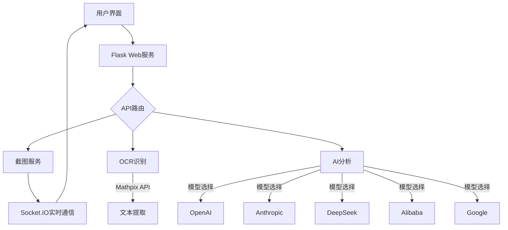

<<<<<<< HEAD
[English README](README_EN.md)

# 📚 Snap-Solver-基础版—免费ai

> 一键识题，自动解答 —— 你的智能解题助手

Snap-Solver 是一个智能题目解答工具，只需**按下快捷键**，即可**在另一台设备上**自动识别题目并给出详细解答。

## ✨ 特色功能

- 🎯 **一键截图**：使用快捷键（可自定义）即可远程监控电脑屏幕
- 🌐 **局域网共享**：一处部署，多处使用，同一网络下**所有设备**都是监控设备
- 🤖 **AI 解答**：推荐使用Kimi直接图片解题，也可选择OCR+Deepseek组合方案
- 💻 **跨平台支持**：Windows、MacOS、Linux、ios、Android全平台可用
> 需要命令行启动。

## 📋 使用前准备

1. **解题方案选择**（二选一）:
   - **方案一：Kimi直接图片解题**
     - 只需配置Kimi API Key
     - 支持直接图片解题，无需OCR
     - 配置简单，有免费额度
     - 访问 [Kimi官网](https://kimi.moonshot.cn/) 注册并获取API Key

   - **方案二：OCR+Deepseek组合**
     - 如果只配置ocr,就是ocr+kimi：
       1. 百度OCR API（用于识别文字，每天1000次免费额度）
          - 访问[百度智能云控制台](https://console.bce.baidu.com/ai-engine/ocr/overview/index)注册
          - 创建文字识别应用获取API Key
       2. Deepseek API（付费服务）
          - 用于解答题目
          - 需要配合OCR使用，因为不支持直接图片解题

3. **配置 API 密钥**：
   - 修改项目根目录中的 `.env.example` 文件重命名为 `.env`
   - 在 `.env` 文件中填入必需的API密钥：
     - Kimi API密钥（MOONSHOT_API_KEY）
   - 如果选择使用Deepseek服务，还需填入（记得删除前面的#）：
     - Deepseek API密钥（DEEPSEEK_API_KEY）
     - 百度OCR相关密钥（APP_ID、API_KEY、SECRET_KEY）

4. **准备环境**：
   - [Node.js](https://nodejs.org/) 14.0 或更高版本
   - [Python](https://www.python.org/downloads/) 3.x 版本

   - 确保系统中安装了 Node.js 和 Python3，并加入环境变量路径。
   - 打开命令行（终端）：
     - Windows用户：按下`Win + R`键，输入`cmd`并回车
     - Mac用户：按下`Command + 空格`键，输入`terminal`并回车
   - 进入项目目录：
     - Windows用户：
       1. 复制项目所在文件夹的完整路径（在文件夹地址栏点击，`Ctrl + C`复制）
       2. 先输入项目所在盘符并回车（例如：`f:`）
       3. 输入`cd `后右键粘贴复制的路径，回车确认
     - Mac用户：
       1. 输入`cd `（注意空格）
       2. 将项目文件夹拖入终端窗口（自动填入路径）
       3. 回车确认
   - 执行以下命令安装依赖：
     ```
     npm install
     pip install keyboard Pillow requests
     ```

5. **启动项目**：在终端（或命令提示符）中执行以下命令启动服务：
   npm start
   **终止指令**
   Ctrl+C

## 💡 使用说明

> 💡 首次使用请先完成【使用前准备】的所有步骤

## ❓ 常见问题

1. **问**：如何确认Node.js和Python安装成功？
   **答**：在命令行中分别输入`node -v`和`python --version`，如果显示版本号就说明安装成功。

2. **问**：安装依赖时报错怎么办？
   **答**：
   - 确保电脑已连接网络
   - 如果提示"npm not found"，说明Node.js没有安装成功
   - 如果提示"pip not found"，说明Python没有安装成功
   - 如果遇到权限相关错误，可以尝试使用管理员权限运行cmd（仅在安装依赖时需要，运行项目时使用普通用户权限即可）

3. **问**：启动服务后打不开网页怎么办？
   **答**：
   - 确保命令行显示服务启动成功
   - 检查浏览器地址是否输入正确
   - 如果用其他设备访问，确保和服务器在同一个网络下

## 💡 使用说明

### 1. 访问服务

- **本机访问**：打开浏览器，访问 http://localhost:3000
- **局域网访问**：其他设备使用 http://[服务器IP]:3000
  > 💡 服务器 IP 会在启动时显示在控制台中

### 2. 截图解题

1. 按下 `Alt + Ctrl + S` 组合键
2. 拖动鼠标选择题目区域
3. 松开鼠标完成截图
4. 选择使用Kimi直接图片解题，或者使用百度OCR文字识别（可以自行调整文字）+Deepseek组合方案

## 📜 开源许可

本项目采用 [MIT](LICENSE) 许可证。
=======
<h1 align="center">Snap-Solver </h1>


<p align="center">
  <b>🔍 一键截屏，自动解题 - 线上考试，从未如此简单</b>
</p>

<p align="center">
  
  
  
  
</p>


<p align="center">
  <a href="#-核心特性">核心特性</a> •
  <a href="#-快速开始">快速开始</a> •
  <a href="#-使用指南">使用指南</a> •
  <a href="#-技术架构">技术架构</a> •
  <a href="#-高级配置">高级配置</a> •
  <a href="#-常见问题">常见问题</a> •
  <a href="#-获取帮助">获取帮助</a>
</p>

<div align="center">
  <a href="https://github.com/Zippland/Snap-Solver/releases">
    
  </a>
  &nbsp;&nbsp;&nbsp;&nbsp;
  <a href="mailto:zylanjian@outlook.com">
    
  </a>
</div>
<!-- <p align="center">
  
</p> -->

## 💫 项目简介

**Snap-Solver** 是一个革命性的AI笔试测评工具，专为学生、考生和自学者设计。只需**按下快捷键**，即可自动截取屏幕上的任何题目，通过AI进行分析并提供详细解答。

无论是复杂的数学公式、物理难题、编程问题，还是其他学科的挑战，Snap-Solver都能提供清晰、准确、有条理的解决方案，帮助您更好地理解和掌握知识点。


## ✨ 核心特性

<table>
  <tr>
    <td width="50%">
      <h3>📱 跨设备协同</h3>
      <ul>
        <li><b>一键截图</b>：按下快捷键，即可在移动设备上查看和分析电脑屏幕</li>
        <li><b>局域网共享</b>：一处部署，多设备访问，提升学习效率</li>
      </ul>
    </td>
    <td width="50%">
      <h3>🧠 多模型AI支持</h3>
      <ul>
        <li><b>GPT-4o/o3-mini</b>：OpenAI强大的推理能力</li>
        <li><b>Claude-3.7</b>：Anthropic的高级理解与解释</li>
        <li><b>DeepSeek-v3/r1</b>：专为中文场景优化的模型</li>
        <li><b>QVQ-MAX/Qwen-VL-MAX</b>：以视觉推理闻名的国产AI</li>
        <li><b>Gemini-2.5-Pro/2.0-flash</b>：智商130的非推理AI</li>
      </ul>
    </td>
  </tr>
  <tr>
    <td>
      <h3>🔍 精准识别</h3>
      <ul>
        <li><b>OCR文字识别</b>：准确捕捉图片中的文本</li>
        <li><b>数学公式支持</b>：通过Mathpix精确识别复杂数学符号</li>
      </ul>
    </td>
    <td>
      <h3>🌐 全球无障碍</h3>
      <ul>
        <li><b>VPN代理支持</b>：自定义代理设置，解决网络访问限制</li>
        <li><b>多语言响应</b>：支持定制AI回复语言</li>
      </ul>
    </td>
  </tr>
  <tr>
    <td>
      <h3>💻 全平台兼容</h3>
      <ul>
        <li><b>桌面支持</b>：Windows、MacOS、Linux</li>
        <li><b>移动访问</b>：手机、平板通过浏览器直接使用</li>
      </ul>
    </td>
    <td>
      <h3>⚙️ 高度可定制</h3>
      <ul>
        <li><b>思考深度控制</b>：调整AI的分析深度</li>
        <li><b>自定义提示词</b>：针对特定学科优化提示</li>
      </ul>
    </td>
  </tr>
</table>

## 🚀 快速开始

### 📋 前置要求

- Python 3.x
- 至少以下一个API Key:
  - OpenAI API Key
  - Anthropic API Key (推荐✅)
  - DeepSeek API Key
  - Alibaba API Key （国内用户首选）
  - Google API Key
  - Mathpix API Key (推荐OCR识别✅)

### 📥 开始使用

```bash
# 启动应用
python app.py
```

### 📱 访问方式

- **本机访问**：打开浏览器，访问 http://localhost:5000
- **局域网设备访问**：在同一网络的任何设备上访问 `http://[电脑IP]:5000`

## 📖 使用指南

<table>
  <tr>
    <td width="33%">
      <h4>1️⃣ 首次配置</h4>
      <p>点击右上角⚙️设置图标，配置API密钥和首选项</p>
    </td>
    <td width="33%">
      <h4>2️⃣ 截图解题</h4>
      <p>点击"截图"按钮 → 裁剪题目区域 → 选择分析方式</p>
    </td>
    <td width="33%">
      <h4>3️⃣ 查看解答</h4>
      <p>实时查看AI分析过程和详细解答，包含思考路径</p>
    </td>
  </tr>
</table>

### 🎯 使用场景示例

- **课后习题**：截取教材或作业中的难题，获取步骤详解
- **编程调试**：截取代码错误信息，获取修复建议
- **考试复习**：分析错题并理解解题思路
- **文献研究**：截取复杂论文段落，获取简化解释

## 🔧 技术架构



### 🧩 组件详情

- **前端**：响应式HTML/CSS/JS界面，支持移动设备
- **后端**：Flask + SocketIO，提供RESTful API和WebSocket
- **AI接口**：多模型支持，统一接口标准
- **图像处理**：高效的截图和裁剪功能

## ⚙️ 高级配置

### 模型选择与优化

| 模型 | 优势 | 适用场景 |
|------|------|----------|
| **GPT-4o** | 多模态支持 | 简单问题，视觉分析 |
| **o3-mini** | 推理支持 | 复杂问题 |
| **Claude-3.7** | 多模态支持，推理支持 | 复杂问题，视觉分析 |
| **DeepSeek-R1** | 推理支持 | 复杂问题 |
| **DeepSeek-V3** | - | 简单问题 |
| **QVQ-MAX** | 多模态支持，推理支持 | 复杂问题，视觉分析 |
| **Qwen-VL-MAX** | 多模态支持 | 简单问题，视觉分析 |
| **Gemini-2.5-Pro** | 多模态支持 | 复杂问题，视觉分析 |
| **Gemini-2.0-Flash** | 多模态支持 | 简单问题，视觉分析 |


### 🛠️ 可调参数

- **温度**：调整回答的创造性与确定性（0.1-1.0）
- **最大输出Token**：控制回答长度
- **推理深度**：标准模式（快速）或深度思考（详细）
- **思考预算占比**：平衡思考过程与最终答案的详细程度
- **系统提示词**：自定义AI的基础行为与专业领域

## ❓ 常见问题

<details>
<summary><b>如何获得最佳识别效果？</b></summary>
<p>
确保截图清晰，包含完整题目和必要上下文。对于数学公式，建议使用Mathpix OCR以获得更准确的识别结果。
</p>
</details>

<details>
<summary><b>无法连接到服务怎么办？</b></summary>
<p>
1. 检查防火墙设置是否允许5000端口<br>
2. 确认设备在同一局域网内<br>
3. 尝试重启应用程序<br>
4. 查看控制台日志获取错误信息
</p>
</details>

<details>
<summary><b>API调用失败的原因？</b></summary>
<p>
1. API密钥可能无效或余额不足<br>
2. 网络连接问题，特别是国际API<br>
3. 代理设置不正确<br>
4. API服务可能临时不可用
</p>
</details>

<details>
<summary><b>如何优化AI回答质量？</b></summary>
<p>
1. 调整系统提示词，添加特定学科的指导<br>
2. 根据问题复杂度选择合适的模型<br>
3. 对于复杂题目，使用"深度思考"模式<br>
4. 确保截取的题目包含完整信息
</p>
</details>

## 🤝 获取帮助

- **代部署服务**：如果您不擅长编程，需要代部署服务，请联系 [zylanjian@outlook.com](mailto:zylanjian@outlook.com)
- **问题报告**：在GitHub仓库提交Issue
- **功能建议**：欢迎通过Issue或邮件提供改进建议

## 📜 开源协议

本项目采用 [Apache 2.0](LICENSE) 协议。
>>>>>>> 06dd82f23603f98cb1591645206b762f8da47cb7
